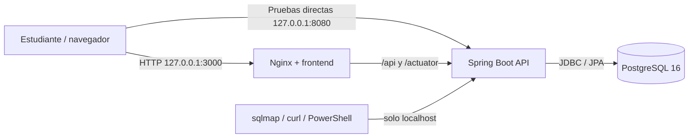
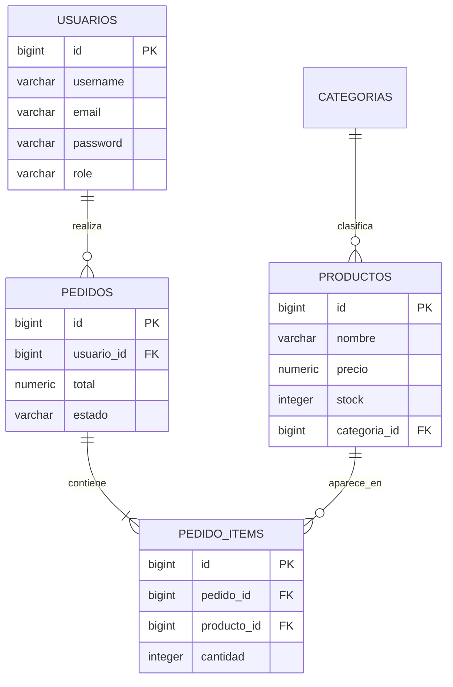

# Arquitectura de despliegue — Tienda Insegura v1

## 1. Objetivo del escenario

El laboratorio busca aproximarse a una aplicación real de tres capas, pero
manteniendo todo aislado en un único equipo o VM:

1. **Presentación:** Nginx sirve HTML, CSS y JavaScript.
2. **Aplicación:** Spring Boot expone la API REST.
3. **Datos:** PostgreSQL persiste usuarios, productos y pedidos.

La aplicación contiene fallas reales a propósito. Por eso se publica solo en
la interfaz de loopback `127.0.0.1`.

## 2. Diagrama lógico



## 3. Diagrama de contenedores

```text
Host o VM de laboratorio
│
├── 127.0.0.1:3000 ──► contenedor frontend
│                       nginx:1.27-alpine
│                       └── proxy /api y /actuator
│
├── 127.0.0.1:8080 ──► contenedor backend
│                       Java 17 + Spring Boot 3.2.5
│                       └── red Docker interna
│
└── 127.0.0.1:5432 ──► contenedor postgres
                        PostgreSQL 16-alpine

Red Docker: tienda_insegura_v1_lab
Volumen: tienda_insegura_v1_postgres_data
```

## 4. Flujo de una petición

### Catálogo

1. El navegador solicita `GET /api/productos`.
2. Nginx reenvía la solicitud a `backend:8080`.
3. `ProductController` llama a `ProductService`.
4. `ProductRepositoryJdbc` consulta PostgreSQL.
5. La respuesta vuelve en JSON.

### Búsqueda vulnerable

1. El navegador o sqlmap envía `q`.
2. `ProductController` no valida el valor.
3. `ProductRepositoryJdbc` concatena `q` en el SQL.
4. PostgreSQL ejecuta la sentencia resultante.
5. La aplicación devuelve los resultados o un stacktrace.

### Diagnóstico vulnerable

1. El cliente envía `host`.
2. `ReportService` lo concatena dentro de un comando de shell.
3. El proceso se ejecuta con los permisos del contenedor backend.
4. La salida se devuelve en la respuesta HTTP.

## 5. Tecnologías

| Componente | Imagen / versión | Responsabilidad |
|---|---|---|
| Frontend | Nginx 1.27 Alpine | Servir UI y actuar como reverse proxy |
| Backend | Eclipse Temurin Java 17 + Spring Boot 3.2.5 | API REST y lógica vulnerable |
| Base de datos | PostgreSQL 16 Alpine | Persistencia relacional |
| Orquestación | Docker Compose v2 | Arranque, red y volumen |
| Pentesting | sqlmap, curl, PowerShell | Validación controlada |


## 6. Modelo de datos simplificado



## 7. Puertos

| Puerto del host | Servicio | Alcance |
|---|---|---|
| 3000 | frontend | solo `127.0.0.1` |
| 8080 | backend | solo `127.0.0.1` |
| 5432 | PostgreSQL | solo `127.0.0.1` |

Los valores pueden cambiarse en `.env`, pero `BIND_ADDRESS` debe permanecer en
`127.0.0.1`.

## 8. Controles de aislamiento del laboratorio

Aunque la V1 es vulnerable, el entorno agrega controles de contención:

- puertos enlazados a loopback;
- red Docker propia;
- red marcada como `internal`;
- datos separados en un volumen dedicado;
- scripts de sqlmap limitados a localhost;
- documentación con advertencia de uso autorizado.

Estos controles **no sanitizan la aplicación**; solo reducen el riesgo de
exposición accidental.

## 9. Diferencias previstas para la V2

La arquitectura base puede mantenerse, pero se agregará:

- Nginx con HTTPS/TLS;
- certificado generado con OpenSSL o proveedor gratuito;
- Spring Security;
- secretos en variables de entorno;
- consultas parametrizadas;
- validación y saneamiento;
- CORS restringido;
- Actuator limitado;
- logs sin datos sensibles;
- cabeceras de seguridad.

